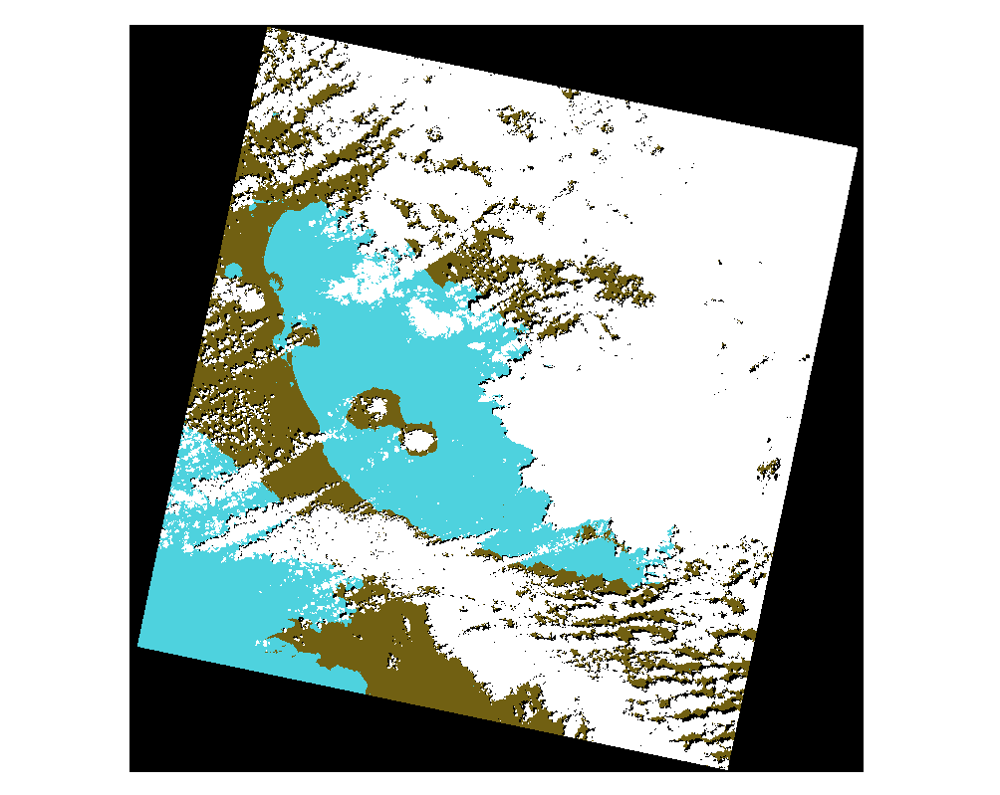
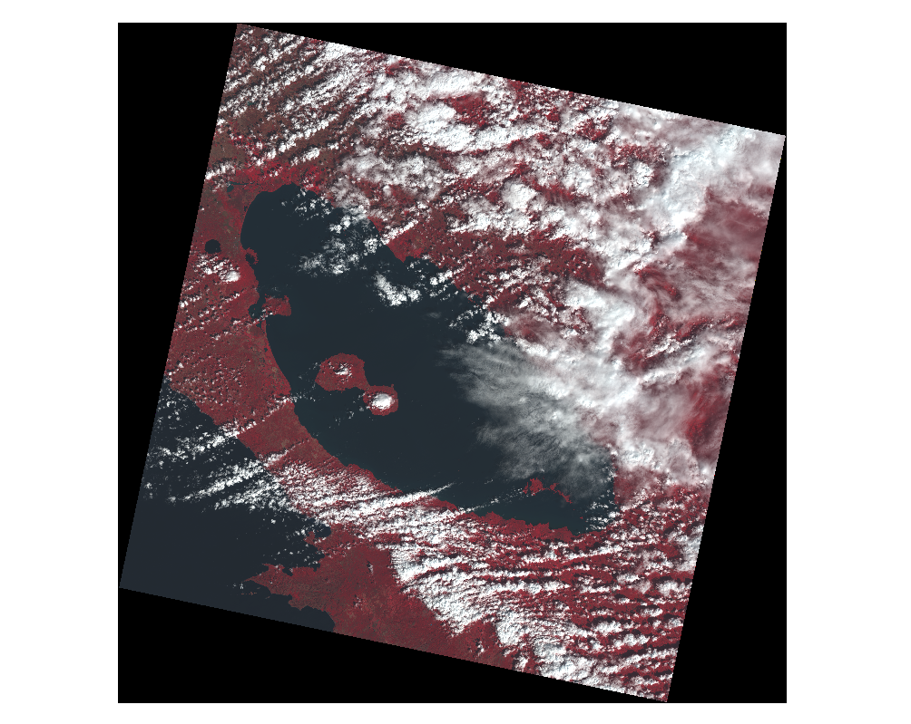

# Scripts de QGIS para procesamiento de datos de Costa Rica para REDD+

Este repositorio contiene un conjunto de *scripts* para procesar datos de Costa Rica relacionados con el mecanismo de [Reducción de Emisiones por Deforestación y Degradación de bosques más conservación y aumento de reservas de carbono forestal (REDD+)](https://es.wikipedia.org/wiki/Reducci%C3%B3n_de_las_emisiones_de_la_deforestaci%C3%B3n). Los scripts de distriuyen como un complemento del sistema de información geográfica [QGIS](https://qgis.org) y su marco de trabajo [Processing](https://docs.qgis.org/3.22/en/docs/user_manual/processing/intro.html).

## Instalación

### Herramientas

1. [QGIS](https://qgis.org): sistema de información geográfica. En este proyecto, se utilizó la **versión 3.22.11 Białowieża LTR**. Siga las instrucciones correspondientes a su sistema operativo en la [página de descargas de QGIS](https://qgis.org/en/site/forusers/download.html). Para el caso de Microsoft Windows, se recomienda el instalador [OSGeo4W](https://qgis.org/en/site/forusers/alldownloads.html#osgeo4w-installer).
2. [Orfeo Toolbox (OTB)](http://orfeo-toolbox.org/): biblioteca para procesamiento de imágenes de satélite. En este proyecto, se utilizó la **versión 8.1.0**. Siga las instrucciones correspondientes a su sistema operativo en la [página de descargas de OTB](https://www.orfeo-toolbox.org/download/).
    1. Configure la [interfaz de QGIS para OTB](https://www.orfeo-toolbox.org/CookBook/QGISInterface.html).
3. [Fmask](https://github.com/GERSL/Fmask): software para detección de nubes y sombras en imágenes satelitales. En este proyecto, se utilizó la **versión 4.6**. Siga las instrucciones correspondientes a su sistema operativo.
4. [R](https://www.r-project.org/) y [RStudio Desktop](https://www.rstudio.com/products/rstudio/): lenguaje de programación para análisis estadístico y ambiente de desarrollo integrado. En este proyecto, se utilizó la **versión 4.2.1 de R** y la **versión 2022.07.1+554 de RStudio Desktop**. Siga las instrucciones correspondientes a su sistema operativo en la [página de descargas de R](https://cloud.r-project.org/) y en la [página de descargas de RStudio](https://www.rstudio.com/products/rstudio/download/).

Adicionalmente, para usuarios avanzados, se recomienda instalar el sistema para control de versiones [Git](https://git-scm.com/). Siga las instrucciones correspondientes a su sistema operativo en la [página de descargas](https://git-scm.com/downloads).

### Complemento `REDD+ Costa Rica` de QGIS
Puede descargar el complemento como un [archivo ZIP](https://github.com/redd-costarica-scripts/redd-costarica-scripts-qgis/archive/refs/heads/main.zip) o a través de Git con el comando:

```shell
git clone https://github.com/redd-costarica-scripts/redd-costarica-scripts-qgis.git
```

El directorio resultante debe ser ubicado en el directorio de complementos de QGIS (ej. `D:\Users\mfvargas\AppData\Roaming\QGIS\QGIS3\profiles\default\python\plugins`).

Luego, debe instalar el complemento con la opción de menú `Complementos - Manejar e instalar complementos` de QGIS.

## Uso
### 1. Descarga de la imagen 
Para descargar la imagen, se recomienda el sitio [Earth Explorer](https://earthexplorer.usgs.gov/) u otro similar. Como resultado de la descarga, debe obtenerse un directorio con los archivos correspondientes a las bandas y a los metadatos de la imagen. Por ejemplo:

```
D:\img\LC09_L1TP_016052_20220123_20220124_02_T1>dir
 Volume in drive D is UserProfile
 Volume Serial Number is DCD0-6D08

 Directory of D:\img\LC09_L1TP_016052_20220123_20220124_02_T1

09/17/2022  03:16 PM    <DIR>          .
09/17/2022  03:16 PM    <DIR>          ..
08/25/2022  06:11 PM           117,265 LC09_L1TP_016052_20220123_20220124_02_T1_ANG.txt
08/25/2022  06:11 PM        92,456,776 LC09_L1TP_016052_20220123_20220124_02_T1_B1.TIF
08/25/2022  06:11 PM        78,117,066 LC09_L1TP_016052_20220123_20220124_02_T1_B10.TIF
08/25/2022  06:11 PM        76,638,423 LC09_L1TP_016052_20220123_20220124_02_T1_B11.TIF
08/25/2022  06:11 PM        93,049,369 LC09_L1TP_016052_20220123_20220124_02_T1_B2.TIF
08/25/2022  06:11 PM        94,258,569 LC09_L1TP_016052_20220123_20220124_02_T1_B3.TIF
08/25/2022  06:11 PM        95,043,094 LC09_L1TP_016052_20220123_20220124_02_T1_B4.TIF
08/25/2022  06:11 PM        96,473,639 LC09_L1TP_016052_20220123_20220124_02_T1_B5.TIF
08/25/2022  06:11 PM        94,374,651 LC09_L1TP_016052_20220123_20220124_02_T1_B6.TIF
08/25/2022  06:11 PM        91,639,190 LC09_L1TP_016052_20220123_20220124_02_T1_B7.TIF
08/25/2022  06:11 PM       371,677,952 LC09_L1TP_016052_20220123_20220124_02_T1_B8.TIF
08/25/2022  06:11 PM        48,009,301 LC09_L1TP_016052_20220123_20220124_02_T1_B9.TIF
08/25/2022  06:11 PM            14,842 LC09_L1TP_016052_20220123_20220124_02_T1_MTL.json
08/25/2022  06:11 PM            12,215 LC09_L1TP_016052_20220123_20220124_02_T1_MTL.txt
08/25/2022  06:11 PM            17,820 LC09_L1TP_016052_20220123_20220124_02_T1_MTL.xml
08/25/2022  06:11 PM         3,225,310 LC09_L1TP_016052_20220123_20220124_02_T1_QA_PIXEL.TIF
08/25/2022  06:11 PM           222,898 LC09_L1TP_016052_20220123_20220124_02_T1_QA_RADSAT.TIF
08/25/2022  06:11 PM         2,227,700 LC09_L1TP_016052_20220123_20220124_02_T1_SAA.TIF
08/25/2022  06:11 PM            49,903 LC09_L1TP_016052_20220123_20220124_02_T1_stac.json
08/25/2022  06:11 PM         1,968,117 LC09_L1TP_016052_20220123_20220124_02_T1_SZA.TIF
08/25/2022  06:11 PM           115,739 LC09_L1TP_016052_20220123_20220124_02_T1_thumb_large.jpeg
08/25/2022  06:11 PM            15,541 LC09_L1TP_016052_20220123_20220124_02_T1_thumb_small.jpeg
08/25/2022  06:11 PM         8,971,879 LC09_L1TP_016052_20220123_20220124_02_T1_VAA.TIF
08/25/2022  06:11 PM         3,433,766 LC09_L1TP_016052_20220123_20220124_02_T1_VZA.TIF
              24 File(s)  1,252,131,025 bytes
```

### 2. Detección de nubes y sombras
Se realiza con el programa FMask. Debe ejecutarse en la línea de comandos del sistema operativo y desde el directorio en el que se encuentran los archivos de la imagen.

Entradas:
- Directorio con archivos de la imagen.

Salidas:
- Archivo raster con pixeles marcados como tierra, agua, nubes o sombras.

```shell
cd LC09_L1TP_016052_20220123_20220124_02_T1
"C:\Program Files\GERS\Fmask_4_6\application\Fmask_4_6.exe"
```

Con bash:
```shell
cd LC09_L1TP_016052_20220123_20220124_02_T1
/usr/GERS/Fmask_4_6/application/run_Fmask_4_6.sh /usr/local/MATLAB/MATLAB_Runtime/v910
```

Como resultado, FMask genera un archivo raster:

```
09/18/2022  06:41 PM         1,691,740 LC09_L1TP_016052_20220123_20220124_02_T1_Fmask4.tif
```

Los pixeles de este archivo tienen 6 posibles valores:

0 = tierra  
1 = agua  
2 = sombra de nubes  
3 = nieve  
4 = nubes  
255 = sin observación  


Imagen: Nubes y sombras detectadas con FMask.

### 3. Creación de una pila de bandas
Se crea una "pila" (*stack*) de bandas en un archivo. Se realiza con el programa [gdal_merge.py](https://gdal.org/programs/gdal_merge.html) de GDAL. Está disponible en la opción de menú `Raster - Miscellaneous - Merge` de QGIS. Debe activarse la opción para almacenar cada archivo de entrada en una banda separada del archivo resultante con la pila.

Entradas:
- Archivos con bandas 2-7.

Salidas:
- Archivo con pila de bandas 2-7.

Con bash:
```shell
# Archivos de entrada con bandas 2-7
b2=LC09_L1TP_016052_20220123_20220124_02_T1/LC09_L1TP_016052_20220123_20220124_02_T1_B2.TIF
b3=LC09_L1TP_016052_20220123_20220124_02_T1/LC09_L1TP_016052_20220123_20220124_02_T1_B3.TIF
b4=LC09_L1TP_016052_20220123_20220124_02_T1/LC09_L1TP_016052_20220123_20220124_02_T1_B4.TIF
b5=LC09_L1TP_016052_20220123_20220124_02_T1/LC09_L1TP_016052_20220123_20220124_02_T1_B5.TIF
b6=LC09_L1TP_016052_20220123_20220124_02_T1/LC09_L1TP_016052_20220123_20220124_02_T1_B6.TIF
b7=LC09_L1TP_016052_20220123_20220124_02_T1/LC09_L1TP_016052_20220123_20220124_02_T1_B7.TIF

# Archivo de salida con pila de bandas 2-7
pila=LC09_L1TP_016052_20220123_20220124_02_T1-REDD/LC09_L1TP_016052_20220123_20220124_02_T1-PILA.TIF

# Creación del archivo con la pila
gdal_merge.py -o $pila -separate -ot Float32 $b2 $b3 $b4 $b5 $b6 $b7
```


Imagen: Pila en falso color (4-3-2).

### 4. Cálculo de reflectancia
Se realiza con el algoritmo `Reflectancia` del complemento `REDD+ Costa Rica`.

Entradas:
- Archivo con pila de bandas 2-7.
- a
- b
- cenit

Salidas:
- Archivo con pila de bandas 2-7 con valores de reflectancia.

Con bash:
```shell
# Archivos de salida con bandas 2-7 con valores de reflectancia
b2_reflectancia=LC09_L1TP_016052_20220123_20220124_02_T1/LC09_L1TP_016052_20220123_20220124_02_T1_B2-REFLECTANCIA.TIF
b3_reflectancia=LC09_L1TP_016052_20220123_20220124_02_T1/LC09_L1TP_016052_20220123_20220124_02_T1_B3-REFLECTANCIA.TIF
b4_reflectancia=LC09_L1TP_016052_20220123_20220124_02_T1/LC09_L1TP_016052_20220123_20220124_02_T1_B4-REFLECTANCIA.TIF
b5_reflectancia=LC09_L1TP_016052_20220123_20220124_02_T1/LC09_L1TP_016052_20220123_20220124_02_T1_B5-REFLECTANCIA.TIF
b6_reflectancia=LC09_L1TP_016052_20220123_20220124_02_T1/LC09_L1TP_016052_20220123_20220124_02_T1_B6-REFLECTANCIA.TIF
b7_reflectancia=LC09_L1TP_016052_20220123_20220124_02_T1/LC09_L1TP_016052_20220123_20220124_02_T1_B7-REFLECTANCIA.TIF

# Archivo de salida con bandas 2-7 con valores de reflectancia en el CRS WGS84 (4326)
# (el comando otbcli_BandMath lo está generando así)
reflectancia_wgs84=LC09_L1TP_016052_20220123_20220124_02_T1/LC09_L1TP_016052_20220123_20220124_02_T1-REFLECTANCIA_WGS84.TIF

# Archivo de salida con bandas 2-7 con valores de reflectancia en el CRS de las bandas originales
reflectancia_wgs84=LC09_L1TP_016052_20220123_20220124_02_T1/LC09_L1TP_016052_20220123_20220124_02_T1-REFLECTANCIA.TIF


# Creación de los archivos con las bandas 2-7 con valores de reflectancia
# (a, b y cenit deben sustituirse por los valores adecuados)
otbcli_BandMath -il $pila -out $b2_reflectancia -exp "(a*im1b1 + (b)) / cos(cenit*3.14159265359/180)"
otbcli_BandMath -il $pila -out $b3_reflectancia -exp "(a*im1b2 + (b)) / cos(cenit*3.14159265359/180)"
otbcli_BandMath -il $pila -out $b4_reflectancia -exp "(a*im1b3 + (b)) / cos(cenit*3.14159265359/180)"
otbcli_BandMath -il $pila -out $b5_reflectancia -exp "(a*im1b4 + (b)) / cos(cenit*3.14159265359/180)"
otbcli_BandMath -il $pila -out $b6_reflectancia -exp "(a*im1b5 + (b)) / cos(cenit*3.14159265359/180)"
otbcli_BandMath -il $pila -out $b7_reflectancia -exp "(a*im1b6 + (b)) / cos(cenit*3.14159265359/180)"

# Creación del archivo con la pila con valores de reflectancia en WGS84
gdal_merge.py \
  -o $reflectancia_wgs84 \
  -separate \
  -ot Float32 \
  $b2_reflectancia $b3_reflectancia $b4_reflectancia $b5_reflectancia $b6_reflectancia $b7_reflectancia

# Creación del archivo con la pila con valores de reflectancia en el CRS de las bandas originales
# (el argumento -t_srs debe tener el CRS adecuado)
gdalwarp $reflectancia_wgs84 $reflectancia -t_srs EPSG:32616
```